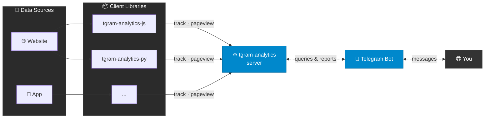

# tgram-analytics

> ⚠️ Independent open-source project. Not affiliated with, endorsed by, or connected
> to Telegram Messenger LLP in any way. "Telegram" is a trademark of Telegram Messenger LLP.

---

**Website analytics delivered to your Telegram chat.**

No dashboard to log into. No new tool to learn. No data leaving your server.
Your Telegram bot tells you what's happening with your website or app — signups,
purchases, errors — whenever you ask, or automatically on a schedule.

---

## How it works

**1. Deploy the server once** — on a VPS, Railway, Fly.io, wherever you like.
Everything runs on your infrastructure. Your data never leaves.

**2. Add your project** — open Telegram, type `/add myapp.com`.
The bot gives you an API key.

**3. Drop in the tracker** — one `<script>` tag for websites, one package for Flutter.

**4. Ask your bot** — `/report signup` sends you a chart. Right there in Telegram.

---

## What you can do

- 📊 `/report <event>` — chart any event across any time range
- 🔔 Alerts — *"tell me every time someone makes a purchase"*
- 📅 Scheduled reports — *"every Monday, send me last week's signups"*
- 🔑 Multi-project — one bot, many projects

---

## Repos

| Repo | What it is |
|---|---|
| [server](https://github.com/tgram-analytics/server) | FastAPI backend + Telegram bot — deploy this |
| [tgram-analytics-js](https://github.com/tgram-analytics/tgram-analytics-js) | `<script>` tracker for websites |
| [tgram-analytics-flutter](https://github.com/tgram-analytics/tgram-analytics-flutter) | Flutter SDK |

---

## Why not Google Analytics?

| | tgram-analytics | Google Analytics / Amplitude |
|---|---|---|
| Login required | ❌ It's in Telegram | ✅ |
| Your server, your data | ✅ | ❌ |
| Price | Free (server costs) | Free → paid |
| Proactive alerts | ✅ Built-in | Paid feature |
| GDPR-friendly | ✅ No third parties | Complicated |
| Setup time | ~5 min | 15–30 min |

---

*Self-hosted. Open source. No dashboards. Just Telegram.*