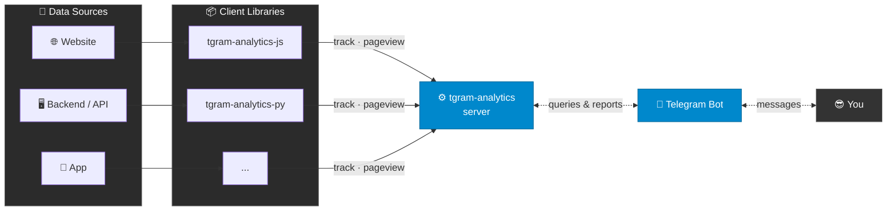

# tgram-analytics

> ⚠️ Independent open-source project. Not affiliated with, endorsed by, or connected
> to Telegram Messenger LLP in any way. "Telegram" is a trademark of Telegram Messenger LLP.

---

**Website analytics delivered to your Telegram chat.**

No dashboard to log into. No new tool to learn. No data leaving your server.
Your Telegram bot tells you what's happening with your website or app — signups,
purchases, errors — whenever you ask, or automatically on a schedule.

---

## How it works


```mermaid
flowchart LR
    subgraph Sources["📡 Data Sources"]
        A["🌐 Website"]
        B["📱 App"]
        C["🖥️ Backend / API"]
    end
    subgraph SDKs["📦 Client Libraries"]
        JS["tgram-analytics-js"]
        PY["tgram-analytics-py"]
        SW["..."]
    end
    S["⚙️ tgram-analytics\nserver"]
    T["🤖 Telegram Bot"]
    U["😎 You"]
    A --> JS
    B --> SW
    C --> PY
    JS -- "track · pageview" --> S
    PY -- "track · pageview" --> S
    SW -- "track · pageview" --> S
    S <-. "queries & reports" .-> T
    T <-. "messages" .-> U
    style Sources fill:#2b2b2b,stroke:#555,color:#fff
    style SDKs fill:#2b2b2b,stroke:#555,color:#fff
    style S fill:#0088cc,stroke:#006699,color:#fff
    style T fill:#0088cc,stroke:#006699,color:#fff
    style U fill:#333,stroke:#555,color:#fff
```

**1. Deploy the server once** — on a VPS, Railway, Fly.io, wherever you like.
Everything runs on your infrastructure. Your data never leaves.

**2. Add your project** — open Telegram, type `/add myapp.com`.
The bot gives you an API key.

**3. Drop in the tracker** — use one SDK or several, depending on what you're building.

**4. Ask your bot** — `/report signup` sends you a chart. Right there in Telegram.

---

## Pick your SDK

Use whichever clients fit your stack. Mix and match — all events land in the same project.

**Just a website?**
```html
<!-- one script tag, done -->
<script src="dist/tga.min.js"></script>
<script>TGA.init("proj_xxx", { serverUrl: "https://your-server.com" });</script>
```
Pageviews and SPA navigation tracked automatically.

**Python backend only?**
```python
from tgram_analytics import TGA

tga = TGA("proj_xxx", "https://your-server.com")
tga.track("subscription_created", session_id=user.id, properties={"plan": "pro"})
```
Track server-side events like payments, signups, or job completions.

**Full-stack app?** Use both — JS SDK on the frontend for pageviews and clicks, Python SDK on the backend for purchases and background jobs. All events flow into the same project and show up in the same `/report`.

---

## What you can do

- 📊 `/report <event>` — chart any event across any time range
- 🔔 Alerts — *"tell me every time someone makes a purchase"*
- 📅 Scheduled reports — *"every Monday, send me last week's signups"*
- 🔑 Multi-project — one bot, many projects

---

## Repos

| Repo | What it is |
|---|---|
| [server](https://github.com/tgram-analytics/server) | FastAPI backend + Telegram bot — deploy this |
| [tgram-analytics-js](https://github.com/tgram-analytics/tgram-analytics-js) | JS/TS SDK — `<script>` tag or npm, for websites and SPAs |
| [tgram-analytics-py](https://github.com/tgram-analytics/tgram-analytics-py) | Python SDK — sync + async, for backends and APIs |
| [tgram-analytics-flutter](https://github.com/tgram-analytics/tgram-analytics-flutter) | Flutter SDK |

---

## Why not Google Analytics?

| | tgram-analytics | Google Analytics / Amplitude |
|---|---|---|
| Login required | ❌ It's in Telegram | ✅ |
| Your server, your data | ✅ | ❌ |
| Price | Free (server costs) | Free → paid |
| Proactive alerts | ✅ Built-in | Paid feature |
| GDPR-friendly | ✅ No third parties | Complicated |
| Setup time | ~5 min | 15–30 min |

---

*Self-hosted. Open source. No dashboards. Just Telegram.*