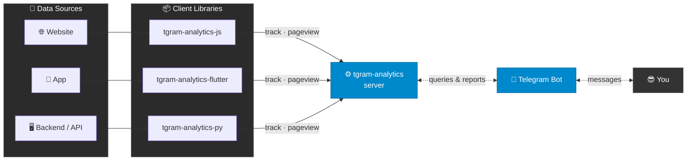

# tgram-analytics

> ⚠️ Independent project. Not affiliated with, endorsed by, or connected
> to Telegram Messenger LLP in any way. "Telegram" is a trademark of Telegram Messenger LLP.

---

**Software analytics delivered to your Telegram chat.**

No dashboard to log into. No new tool to learn.
Your Telegram bot tells you what's happening with your website or app — signups,
purchases, errors — whenever you ask, and alerts you the moment key events fire.

**Try it now:** message [@MyTelegramAnalyticsBot](https://t.me/MyTelegramAnalyticsBot) (1 project free — see [tgram-analytics.com](https://tgram-analytics.com)), or [self-host the server](https://github.com/tgram-analytics/server) and no data ever leaves your infrastructure.

---

## How it works


```mermaid
flowchart LR
    subgraph Sources["📡 Data Sources"]
        A["🌐 Website"]
        B["📱 App"]
        C["🖥️ Backend / API"]
    end
    subgraph SDKs["📦 Client Libraries"]
        JS["tgram-analytics-js"]
        FL["tgram-analytics-flutter"]
        PY["tgram-analytics-py"]
    end
    S["⚙️ tgram-analytics\nserver"]
    T["🤖 Telegram Bot"]
    U["😎 You"]
    A --> JS
    B --> FL
    C --> PY
    JS -- "track · pageview" --> S
    FL -- "track · pageview" --> S
    PY -- "track · pageview" --> S
    S <-. "queries & reports" .-> T
    T <-. "messages" .-> U
    style Sources fill:#2b2b2b,stroke:#555,color:#fff
    style SDKs fill:#2b2b2b,stroke:#555,color:#fff
    style S fill:#0088cc,stroke:#006699,color:#fff
    style T fill:#0088cc,stroke:#006699,color:#fff
    style U fill:#333,stroke:#555,color:#fff
```

**1. Open [@MyTelegramAnalyticsBot](https://t.me/MyTelegramAnalyticsBot) or [self-host the server](https://github.com/tgram-analytics/server)** — hosted for zero setup, self-hosted so your data stays on your infrastructure.

**2. Add your project** — open Telegram, type `/add myapp.com`.
The bot gives you an API key.

**3. Drop in the tracker** — use one SDK or several, depending on what you're building.

**4. Ask your bot** — `/report signup` sends you a chart. Right there in Telegram.

---

## Pick your SDK

Use whichever clients fit your stack. Mix and match — all events land in the same project.

**Just a website?**
```html
<!-- one script tag, done -->
<script src="https://your-server.com/sdk/tga.min.js"></script>
<script>TGA.init("proj_xxx", { serverUrl: "https://your-server.com" });</script>
```
Pageviews and SPA navigation tracked automatically.

**Flutter / Dart app?**
```dart
// Track anywhere — even before init:
TGA.track('signup', sessionId);

// In main():
TGA.init('proj_xxx', 'https://your-server.com');
// ^ buffered events flush automatically
```

**Python backend?**
```python
from tgram_analytics import TGA

tga = TGA("proj_xxx", "https://your-server.com")
tga.track("subscription_created", session_id=user.id, properties={"plan": "pro"})
```

**Full-stack app?** Mix and match — JS on the frontend, Flutter in the app, Python on the backend. All events flow into the same project and show up in the same `/report`.

---

## What you can do

- 📊 `/report <event>` — chart any event across any time range
- 🔔 Alerts — *"tell me every time someone makes a purchase"*
- 📅 `/digest` — a 7-day recap with week-over-week deltas, whenever you ask
- 🔑 Multi-project — one bot, many projects

---

## Repos

| Repo | What it is |
|---|---|
| [server](https://github.com/tgram-analytics/server) | FastAPI backend + Telegram bot — deploy this |
| [tgram-analytics-js](https://github.com/tgram-analytics/tgram-analytics-js) | JS/TS SDK — `<script>` tag or npm, for websites and SPAs |
| [tgram-analytics-flutter](https://github.com/tgram-analytics/tgram-analytics-flutter) | Dart/Flutter SDK — singleton with pre-init buffering |
| [tgram-analytics-py](https://github.com/tgram-analytics/tgram-analytics-py) | Python SDK — sync + async, for backends and APIs |

SDKs are MIT-licensed; the server is source-available under FSL-1.1. Explore the org for more!

---

## Why not Google Analytics?

| | tgram-analytics self-hosted | Google Analytics / Amplitude |
|---|---|---|
| Login required | ❌ It's in Telegram | ✅ |
| Your server, your data | ✅ | ❌ |
| Price | Free (server costs) | Free → paid |
| Proactive alerts | ✅ Built-in | Paid feature |
| GDPR-friendly | ✅ No third parties | Complicated |
| Setup time | ~5 min | 15–30 min |

---

*Hosted or self-hosted. MIT SDKs, source-available server. No dashboards. Just Telegram.*
